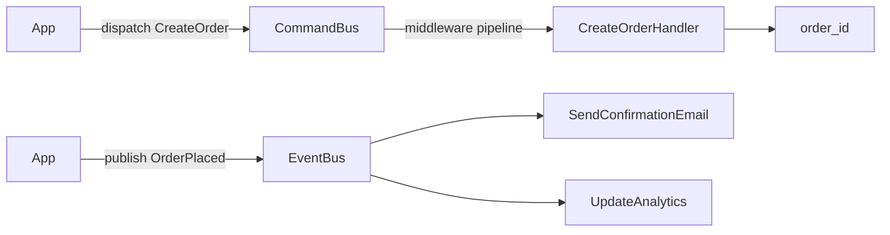
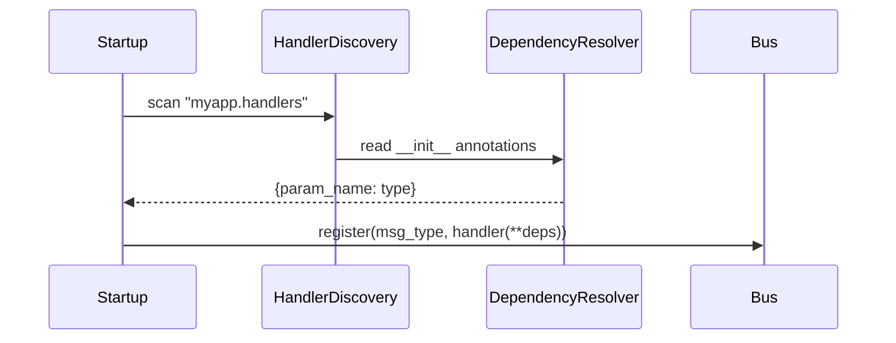

# cqrs-bus

An async **CQRS command/query bus and mediator** for Python with handler
auto-discovery — think [MediatR](https://github.com/jbogard/MediatR), but for
async Python with zero runtime dependencies.

Your app dispatches commands and queries without knowing what handles them.
Handlers live in their own modules, get picked up automatically at startup, and
their dependencies are resolved from `__init__` type annotations. No decorators,
no registry to hand-maintain.

## Features

- **Command / query buses** — one message, exactly one handler, statically typed end to end.
- **Event bus** — one event, many subscribers, run concurrently and in isolation.
- **Handler auto-discovery** — point it at a package; it finds every handler.
- **Type-based dependency injection** — deps resolved from `__init__` annotations, validated at build time.
- **Middleware pipeline** — onion-style cross-cutting behavior (transactions, retries, auth, timing).
- **Observability** — structured logs + optional Prometheus metrics, no setup.
- **Zero runtime deps** — Python 3.11+, stdlib only (Prometheus is opt-in).

## How it works

A **command/query** flows through the middleware pipeline to its single handler.
An **event** fans out to every subscriber:



Middleware wraps each dispatch **outermost-first** — first added is first in, last out:


At startup, `build_buses` scans your handlers package, reads each handler's
`__init__` annotations, injects matching dependencies, and registers live buses:



## Quick start

`Command` and `Query` are plain marker base classes — they carry no fields of
their own. Add data however you like (`@dataclass`, Pydantic, `attrs`). Optionally
parameterize the message with its result type for end-to-end typing:

```python
from dataclasses import dataclass

from cqrs_bus import Command, CommandHandler, CommandBus

@dataclass
class CreateOrder(Command[str]):        # resolves to a str
    customer_id: str
    total: float

class CreateOrderHandler(CommandHandler[CreateOrder, str]):
    def __init__(self, db: Database):   # dep injected by type
        self.db = db

    async def handle(self, command: CreateOrder) -> str:
        return await self.db.insert_order(command.customer_id, command.total)

bus = CommandBus()
bus.register(CreateOrder, CreateOrderHandler(db=my_db))

order_id = await bus.dispatch(CreateOrder(customer_id="c-123", total=49.99))  # inferred: str
```

Queries are identical with `Query` / `QueryHandler` / `QueryBus`. The result-type
parameter is optional; an unparameterized `Command` dispatches to `Any`.

## Events

A command has exactly one handler; an **event** can have many — or none. Use
`EventBus` to publish domain events (something that *happened*) to every subscriber:

```python
from dataclasses import dataclass

from cqrs_bus import Event, EventHandler, EventBus

@dataclass
class OrderPlaced(Event):
    order_id: str

class SendConfirmationEmail(EventHandler[OrderPlaced]):
    async def handle(self, event: OrderPlaced) -> None: ...

bus = EventBus()
bus.subscribe(OrderPlaced, SendConfirmationEmail())

await bus.publish(OrderPlaced(order_id="o-1"))   # every subscriber runs
bus.handler_count(OrderPlaced)                   # -> 1
```

Subscribers run **concurrently and in isolation**: one failing handler is logged
(and counted in metrics) but never aborts the others, and `publish` itself does
not raise. Publishing with no subscribers is a no-op.

## Auto-discovery

With more than a handful of handlers, let discovery find them. Lay them out in
`commands/`, `queries/`, and `events/` packages:

```
myapp/handlers/
  commands/create_order.py   # CreateOrderHandler
  queries/get_order.py       # GetOrderHandler
  events/order_placed.py     # one or more OrderPlaced subscribers
```

`build_buses` is the one-liner — point it at the package, hand it the shared
dependencies, get ready-to-use buses:

```python
from cqrs_bus import build_buses

buses = build_buses(
    "myapp.handlers",
    dependencies={Database: my_db},
    strict=False,        # True -> discovery errors raise instead of skip+log
    on_dispatch=my_hook, # optional telemetry callback, wired into all three buses
)

order_id = await buses.command_bus.dispatch(CreateOrder(customer_id="c-123", total=49.99))
order    = await buses.query_bus.dispatch(GetOrder(order_id=order_id))
await buses.event_bus.publish(OrderPlaced(order_id=order_id))
```

Dependencies are injected **by type annotation**: a handler whose `__init__` takes
`db: Database` receives whatever you registered under the `Database` key.
`Optional[T]` / `T | None` are unwrapped, a registered base type satisfies a
subclass annotation, and a parameter with a default is skipped when unresolved.
Missing dependencies raise at build time, not on first dispatch.

<details>
<summary>Lower-level building blocks (bring your own DI container)</summary>

Drop down to `HandlerDiscovery` (which finds handlers) and the bus `register`
methods to control instantiation yourself:

```python
from cqrs_bus import HandlerDiscovery, CommandBus

registry = HandlerDiscovery(base_package="myapp.handlers").discover_all_handlers()

command_bus = CommandBus()
for meta in registry.get_all_command_handlers():
    deps = {name: my_container.resolve(dep) for name, dep in meta.dependencies.items()}
    command_bus.register(meta.command_or_query_type, meta.handler_class(**deps))
```

`DependencyResolver` inspects a handler class and returns a `{param_name: type}`
dict you can feed to any DI container or factory. `get_all_query_handlers()` and
`get_all_event_handlers()` work the same way.

</details>

## Middleware

Wrap every dispatch with cross-cutting behavior. A middleware receives the message
and a `call_next` continuation; it can inspect or replace the message, short-circuit,
transform the result, or catch errors:

```python
async def transactional(message, call_next):
    async with db.transaction():
        return await call_next(message)

bus = CommandBus(middleware=[transactional])   # or bus.add_middleware(...)
```

Middlewares run **outermost-first** (see diagram above). Both `CommandBus` and
`QueryBus` support them via the shared `MessageBus` base; the `on_dispatch` callback
and metrics measure the whole pipeline, middleware included.

## Observability

Structured logs on every dispatch, carrying a per-dispatch UUID and the message
name as extras (`command_id`/`command_type`, `query_id`/`query_type`,
`event_id`/`event_type`):

- `DEBUG` — normal dispatch.
- `INFO` — slow command (> 1s); **CommandBus only**.
- `ERROR` — handler failure, with full traceback.

If `prometheus-client` is installed, metrics are registered on import — no setup:

| Bus     | executions                  | duration                   | errors                       |
| ------- | --------------------------- | -------------------------- | ---------------------------- |
| command | `command_executions_total`  | `command_duration_seconds` | `command_errors_total`       |
| query   | `query_executions_total`    | `query_duration_seconds`   | `query_errors_total`         |
| event   | `event_publications_total`  | `event_duration_seconds`   | `event_handler_errors_total` |

Pass an `on_dispatch=callback` to any bus constructor for your own telemetry:
`(name: str, duration: float, error: Exception | None)`.

## Errors

All discovery/wiring errors subclass `HandlerDiscoveryError`:

| Exception                | Raised when                                                    |
| ------------------------ | ------------------------------------------------------------- |
| `MissingDependencyError` | a handler dep isn't in the map, or the handler won't construct |
| `DuplicateHandlerError`  | two handlers target the same command or query                  |
| `InvalidHandlerError`    | a discovered handler has an invalid shape                       |
| `HandlerDiscoveryError`  | base class / other discovery failure                           |

## Install & requirements

```bash
pip install cqrs-bus                 # core, zero runtime deps
pip install "cqrs-bus[prometheus]"  # with Prometheus metrics
```

Python 3.11+. MIT licensed.
